# Agent Socket
### The Universal Protocol for AI Agents.

**Agent Socket** is a **Compute-Agnostic**, WebSocket-first wire protocol engineered from first principles for modern AI Agents. It is designed as a high-performance, bidirectional alternative to HTTP-based standards (like MCP), running equally well on **Serverless** (Lambda/Edge) and **Stateful** (Docker/Rust/Python) backends.

> **⚠️ Current Status:** This project is in the **Request for Comments (RFC)** phase. The architecture is defined, and we are now assembling the core contributor team to build the reference implementations. [Join the Discord](https://discord.gg/qdJ6tc49C) to get involved.

---

## ⚡ The Problem: Standardizing Technical Debt
The industry is currently standardizing on **HTTP + SSE** for agentic systems (via MCP). This forces 2025 AI agents to operate with 2015 constraints:
* **High Latency:** Handshake overhead per interaction.
* **Unidirectional:** Servers cannot interrupt or steer the client effectively.
* **Stateless Lock-in:** Forces architectures to use external databases for context, even when unnecessary.

## 🚀 The Solution: Agent Socket
**Agent Socket** separates the *protocol state* from the *compute runtime*. It offers two distinct modes of operation:

1.  **Direct Mode:** Low-latency (<10ms) stateful connection for dedicated servers (Rust/Python).
2.  **Relay Mode:** Persistent state management for ephemeral serverless functions (Lambda/Workers).
---
### 📐 Architecture Deep Dive

<strong>Mode 1: Direct Architecture (Rust/Python)</strong> - <em>Click to Expand</em>

 
Designed for maximum performance (<10ms) using long-lived TCP connections handled directly by the SDK.

```mermaid
sequenceDiagram
    autonumber
    participant C as 📱 Client
    participant S as 🦀 Agent Runtime (Rust/Python)
    participant LLM as 🧠 LLM / Tools

    Note over C, S: ⚡ Mode 1: Direct State | <10ms Latency
    
    C->>S: GET /ws (Upgrade: websocket)
    S-->>C: 101 Switching Protocols (Sec-WebSocket-Protocol: asp-v1)
    
    note right of C: Persistent TCP Session
        
    loop Heartbeat (Every 30s)
        C-->>S: [0x9 PING]
        S-->>C: [0x10 PONG]
    end

    C->>S: [0x02 INVOKE] Binary Frame (MsgPack)
    activate S
    S->>S: Deserialize & Validate
    S->>LLM: Stream Inference
    
    loop Token Stream
        LLM-->>S: Token "A"
        S-->>C: [0x03 STREAM] Token "A"
    end
    
    S-->>C: [0x06 COMPLETE] Execution Metrics
    deactivate S
```  

 
<strong>Mode 2: Relay Architecture (Serverless)</strong> - <em>Click to Expand</em>

Designed for AWS Lambda and Edge environments. The Relay holds the connection, preventing cold-start penalties from affecting the client handshake.

```mermaid
sequenceDiagram
    autonumber
    participant C as 📱 Client
    participant R as 🔄 Socket Relay (Edge)
    participant L as λ Serverless Fn

    Note over C, R: 🚀 Mode 2: Relay | Zero Cold-Start
    
    C->>R: Connect (WSS)
    R-->>C: [0x01 HELLO] ConnectionId: 7f8a...
    
    note right of C: Connection State Held at Edge
        
    C->>R: [0x02 INVOKE] Payload
    
    Note over R, L: Map WebSocket Frame -> HTTP Event
    R->>L: POST /invoke (Body: {cid: 7f8a, payload: ...})
    
    activate L
    L->>L: 🧊 Init / Re-hydrate Context
    L->>L: Execute Logic
    
    loop HTTP Chunked Transfer
        L-->>R: HTTP Data Chunk
        R-->>C: [0x03 STREAM] Binary Frame
    end
    
    L-->>R: 200 OK (X-Cpu-Time: 45ms)
    deactivate L
    
    R->>C: [0x05 TOOL_DEF] Async Push
```

 

---
## ⚔️ Agent Socket vs. MCP (HTTP)

| Feature | Agent Socket (This Protocol) | MCP (HTTP + SSE) |
| :--- | :--- | :--- |
| **Transport** | **WebSockets (Binary)** | HTTP (Text/JSON) |
| **Latency** | **< 10ms - 30ms** | 100ms+ (Per Request) |
| **Communication** | **True Full-Duplex** | Request / Response |
| **Flexibility** | **Universal** (Server or Serverless) | Server-Centric |
| **Discovery** | **Async / Just-in-Time** | Upfront / Static |
| **Overhead** | **Minimal** (Binary frames) | Heavy (HTTP Headers) |

---

## ✨ Core Features

### 1. True Full-Duplex Communication
Unlike HTTP, where the client must ask before the server speaks, Agent Socket allows agents to push updates, request clarification, or discover tools asynchronously without a new request cycle.

### 2. Adaptive Runtime Support
* **Running on Docker?** Use the Rust/Python SDKs for raw performance.
* **Running on Lambda?** Use the Relay pattern to maintain state without paying for idle server time.

### 3. Binary Efficiency
By eliminating repetitive HTTP headers and using optimized binary framing, Agent Socket reduces network bandwidth usage by up to **50%** compared to verbose JSON-over-HTTP protocols.

---

## 🗺️ Roadmap

- [x] **Phase 1:** Architecture & Theory Validation (Completed Dec 2025)
- [ ] **Phase 2:** Formal Specification White Paper (Q1 2026)
- [ ] **Phase 3:** Reference Implementation (TypeScript/Rust/Python/Node.js) (Q1 2026)
- [ ] **Phase 4:** Python SDK, Rust SDK & Benchmarks

---

## 🤝 Community & Contributing
We are actively seeking **Rust**, **Python**, and **TypeScript** engineers to help build the reference implementation.

* **💬 Discord:** [Join the Agent Socket Server](https://discord.gg/qdJ6tc49C) (Best for real-time discussion)
* **💡 Discussions:** [GitHub Discussions Tab](https://github.com/kunalgawde/agent-socket/discussions) (Best for RFC feedback)
* **🔗 Connect:** [Kunal Gawde on LinkedIn](https://www.linkedin.com/in/kunal-gawde)

---

## 👤 Author & Philosophy
**Architected by Kunal Gawde**

> *"We shouldn't standardize on technical debt. Protocols shouldn't dictate infrastructure—they should empower it. Agent Socket assumes you want the freedom to choose."*

---
## 📄 License
Copyright © 2025 Kunal Gawde. All Rights Reserved.

Licensed under the **Apache 2.0 License** (the "License"); you may not use this file except in compliance with the License. You may obtain a copy of the License at

    http://www.apache.org/licenses/LICENSE-2.0

Unless required by applicable law or agreed to in writing, software distributed under the License is distributed on an "AS IS" BASIS, WITHOUT WARRANTIES OR CONDITIONS OF ANY KIND, either express or implied. See the License for the specific language governing permissions and limitations under the License.
